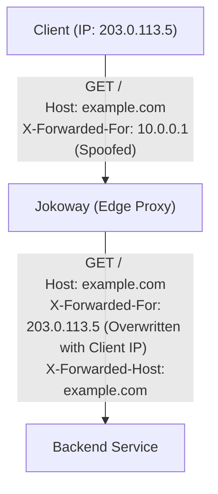
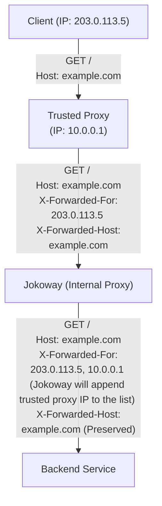

# Jokoway Forwarded Middleware

Forwarded middleware for Jokoway

## Installation

by default this extension already included in `jokoway` crate via `forwarded` feature.

## Configuration

```yaml
jokoway:
  http_forwarded:
    # Enable or disable the middleware.
    enabled: true
    # List of trusted proxy CIDR ranges (IPv4 and IPv6).
    trusted_proxies:
      - "[IPV4_ADDRESS]"
      - "[IPV6_ADDRESS]"
```

If the `trusted_proxies` configuration is not set, it means that jokoway acts as an edge proxy. In this case, Jokoway will “overwrite” the X-forwarded-* headers according to the current client request information (such as the IP address and `Host` header) then pass it to upstream. This is useful for simple deployments where Jokoway is the only proxy in front of the backend services.



If the `trusted_proxies` configuration is set, it means that Jokoway operates behind other proxies and only accepts requests from trusted sources. If the `X-Forwarded-*` header has been set by a previous proxy, jokoway will not overwrite any header values unless “they are not set”.



> [!NOTE]
> Jokoway will return a 403 response if the IP address is not on the list of trusted sources.
